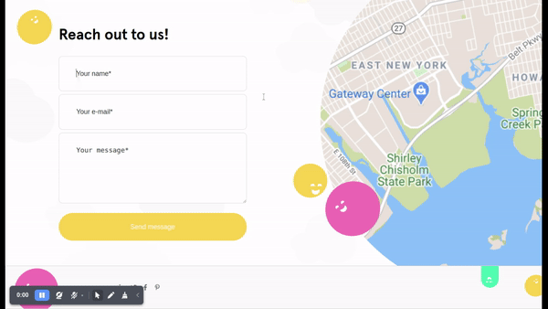
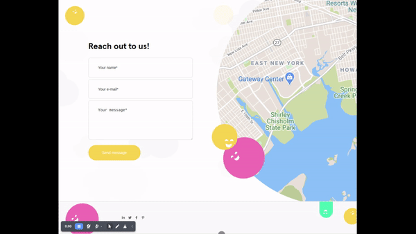

# Frontend of the Feedbacks App - Zenbit Tech

## Demo

   
  

## Technologies used:

 -  React
  -  Vite
 -  Typescript
 -  Styled Components
 -  Axios

## Links

 - [Try the api](https://feedbacks-api-zenbit.herokuapp.com) 
 - [Try the app](https://feedbacks-app-zenbit.herokuapp.com/) 

## Guide
To run the app locally:

    git clone git@github.com:Leolucas12/feedbacks-app.git
    npm i
    npm start

